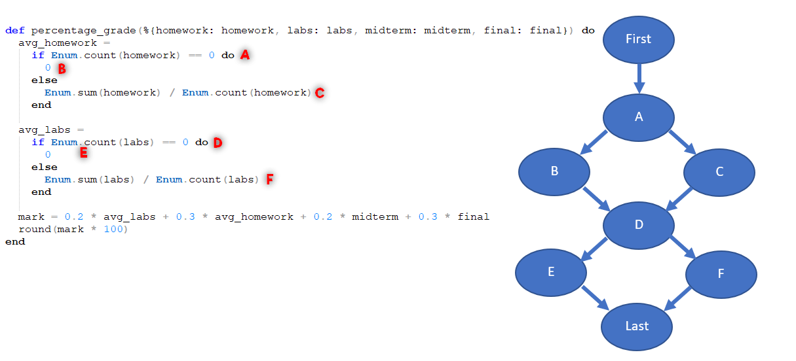
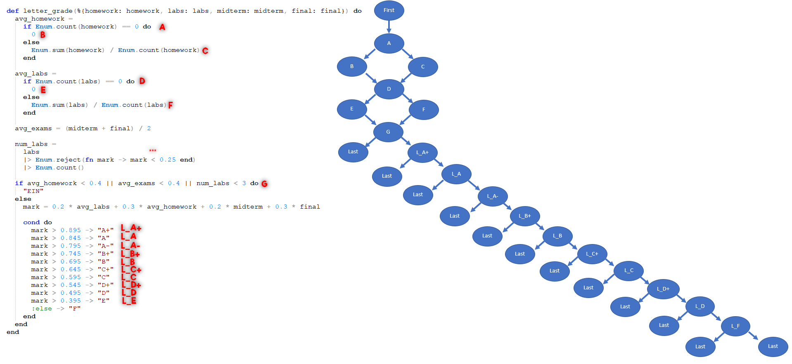
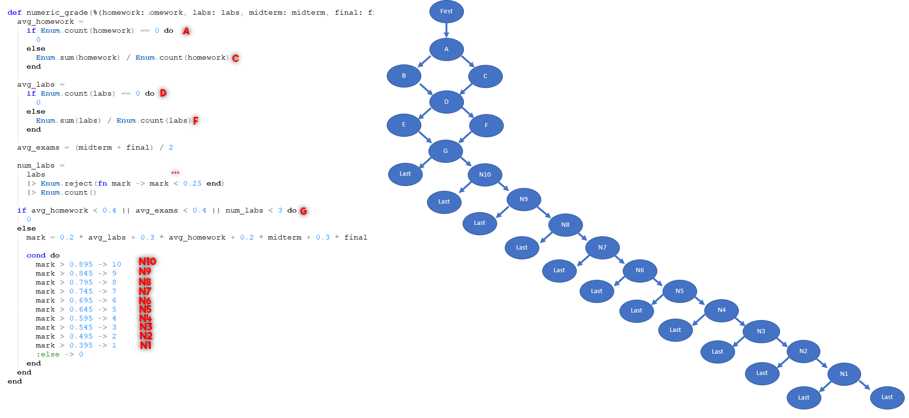
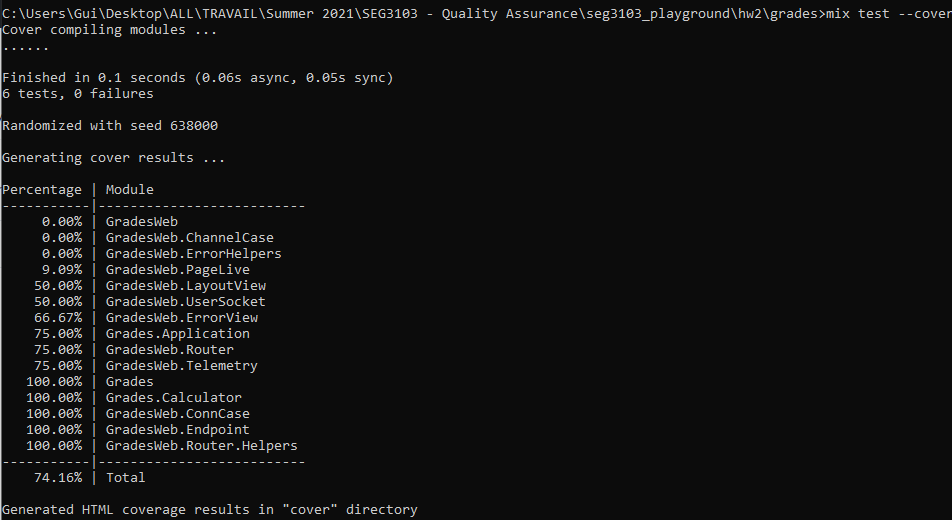

# Homework 2

| Outline | Value |
| --- | --- |
| Course | SEG 3103 |
| Date | Summer 2021 |
| Professor | Andrew Forward, aforward@uottawa.ca |
| Team | Guillaume Labasse 300132984 |

**N.B.:** If submitting between 23h and midnight is considered late work, please grade [hw2](https://github.com/Guy-L/seg3103_playground/tree/master/hw2) instead.

### Table of Contents  
[System & Environment](#system--environment)  
Answers:
* **[Question 1]**()  
	* [Question 1.1]()
	* [Question 1.2]()
	* [Question 1.3]()
	* [Question 1.4]()
* **[Question 2]**()  
	* [Question 2.1]()
	* [Question 2.2]()
	* [Question 2.3]()
	* [Question 2.4]()

   

### System & Environment

**OS**: Windows 10 
**Java**: 1.8.0_291 (Java 8) 
**JUnit**: 5 (via Standalone) 
**Eclipse**: 4.13.0 
**Elexir**: 1.12.0 (with Erlang 22.3)

   

## Question 1

### Question 1.1
For `percentage_grade()`:

For `letter_grade()`:

For `numeric_grade()`:

**\*\*\***: While the `reject` method includes both a loop and a conditional, it still all belongs to one node according to [the teacher](https://piazza.com/class/knxg0zgsce5jp?cid=206). 

**N.B.**: Since we do not have `return` statements (which "jump" back out of the method when read), it would be more accurate to show one and only one "Last" node which all my current "Last" nodes point to in the `letter_grade` and `numeric_grade` charts. For convenience sake and to save time, I did not do this. I hope this is okay.

### Question 1.2
**Note:** I am assuming that since our focus is mainly on branch coverage, the *Conditions Covered* field should only indicate whether each decision node condition passed. For instance, A's condition passing (`Enum.count(homework) == 0`) is expressed as AT (for true), and it not passing (`Enum.count(homework) != 0`) as AF (for false).

For `percentage_grade()`:
| Test Case Number | Test Data | Expected Results | Conditions Covered | Branches Covered |
| --- | --- | --- | --- | --- |
| 1 | [0.8], [1,1,1], 0.7, 0.9 | 85 | AF, DF | C, F |
| 2 | [], [], 0.3, 0.4 | 18 | AT, DT | B, E |

For `letter_grade()`:
| Test Case Number | Test Data | Expected Results | Conditions Covered | Branches Covered |
| --- | --- | --- | --- | --- |
| 1 |  [], [], 0, 0 | EIN                      | AT, DT, GT | B, E |
| 2 |  [0.9], [1,1,1], 0.8, 0.9 | A+           | AF, DF, GF, L_A+T | C, F, L_A+ |
| 3 |  [0.8], [1,1,1], 0.7, 0.9 | A            | AF, DF, GF, L_A+F, L_AT | C, F, L_A+, L_A |
| 4 |  [0.8], [1,0.9,0.7], 0.7, 0.9 | A-       | AF, DF, GF, L_A+F, L_AF, L_B+T | C, F, L_A+, L_A, L_B+ |
| 5 |  [0.7], [0.9,0.9,0.7], 0.7, 0.8 | B+     | AF, DF, GF, L_A+F, L_AF, L_B+F, L_BT | C, F, L_A+, L_A, L_B+, L_B |
| 6 |  [0.8], [0.7,0.6,0.7], 0.6, 0.7 | B      | AF, DF, GF, L_A+F, L_AF, L_B+F, L_BT, ... | C, F, L_A+, L_A, L_B+, L_B, ... |
| 7 |  [0.7], [0.7,0.6,0.7], 0.6, 0.7 | C+     | AF, DF, GF, L_A+F, L_AF, L_B+F, L_BT, ... | C, F, L_A+, L_A, L_B+, L_B, ... |
| 8 |  [0.7], [0.7,0.5,0.7], 0.6, 0.5 | C      | AF, DF, GF, L_A+F, L_AF, L_B+F, L_BT, ... | C, F, L_A+, L_A, L_B+, L_B, ... |
| 9 |  [0.5], [0.7,0.5,0.7], 0.6, 0.5 | D+     | AF, DF, GF, L_A+F, L_AF, L_B+F, L_BT, ... | C, F, L_A+, L_A, L_B+, L_B, ... |
| 10 | [0.5], [0.7,0.2,0.7,0.5], 0.5, 0.5 | D  | AF, DF, GF, L_A+F, L_AF, L_B+F, L_BT, ... | C, F, L_A+, L_A, L_B+, L_B, ... |
| 11 | [0.5], [0.4,0.4,0.4], 0.5, 0.5 | E      | AF, DF, GF, L_A+F, L_AF, L_B+F, L_BT, ... | C, F, L_A+, L_A, L_B+, L_B, ... |
| 12 | [0.4], [0.4,0.4,0.4], 0.5, 0.3 | F      | AF, DF, GF, L_A+F, L_AF, L_B+F, L_BT, ... | C, F, L_A+, L_A, L_B+, L_B, ... |

For `numeric_grade()`:
| Test Case Number | Test Data | Expected Results | Conditions Covered | Branches Covered |
| --- | --- | --- | --- | --- |
| 1 |  [], [], 0, 0 | 0                        | AT, DT, GT | B, E |
| 2 |  [0.9], [1,1,1], 0.8, 0.9 | 10           | AF, DF, GF, N10T | C, F, N10 |
| 3 |  [0.8], [1,1,1], 0.7, 0.9 | 9            | AF, DF, GF, N10F, N9T | C, F, N10, N9 |
| 4 |  [0.8], [1,0.9,0.7], 0.7, 0.9 | 8        | AF, DF, GF, N10F, N9F, N8T | C, F, N10, N9, N7 |
| 5 |  [0.7], [0.9,0.9,0.7], 0.7, 0.8 | 7      | AF, DF, GF, N10F, N9F, N8F, N7T | C, F, N10, N9, N8, N7 |
| 6 |  [0.8], [0.7,0.6,0.7], 0.6, 0.7 | 6      | AF, DF, GF, N10F, N9F, N8F, N7F, ... | C, F, N10, N9, N8, N7, ... |
| 7 |  [0.7], [0.7,0.6,0.7], 0.6, 0.7 | 5      | AF, DF, GF, N10F, N9F, N8F, N7F, ... | C, F, N10, N9, N8, N7, ... |
| 8 |  [0.7], [0.7,0.5,0.7], 0.6, 0.5 | 4      | AF, DF, GF, N10F, N9F, N8F, N7F, ... | C, F, N10, N9, N8, N7, ... |
| 9 |  [0.5], [0.7,0.5,0.7], 0.6, 0.5 | 3      | AF, DF, GF, N10F, N9F, N8F, N7F, ... | C, F, N10, N9, N8, N7, ... |
| 10 | [0.5], [0.7,0.2,0.7,0.5], 0.5, 0.5 | 2  | AF, DF, GF, N10F, N9F, N8F, N7F, ... | C, F, N10, N9, N8, N7, ... |
| 11 | [0.5], [0.4,0.4,0.4], 0.5, 0.5 | 1      | AF, DF, GF, N10F, N9F, N8F, N7F, ... | C, F, N10, N9, N8, N7, ... |
| 12 | [0.4], [0.4,0.4,0.4], 0.5, 0.3 | 0      | AF, DF, GF, N10F, N9F, N8F, N7F, ... | C, F, N10, N9, N8, N7, ... |

### Question 1.3
Please see [`calculator_test.exs`](https://github.com/Guy-L/seg3103_playground/blob/master/hw2/grades/test/grades/calculator_test.exs).

### Question 1.4
I was able to obtain 100% statement coverage for `Grades.Calculator` according to ExUnit:

To aid myself during the assignment, I also implemented both the Calculator code and a test suite [in Java](https://github.com/Guy-L/seg3103_playground/blob/master/hw2/grades_java%20(optional)/test/CalculatorTest.java) in order to run Jacoco against it, but I discovered that Jacoco does Condition/Branch coverage rather than simple Branch coverage, so I wasn't able to reach 100% branch coverage there. I could've done so by adding test cases for the different conditions of `if(avgHomework < 0.4 || avgExams < 0.4 || numLabs < 3)`, but this would've been irrelevant for our purposes.

Since all branches of our program result in some statement being executed (there are no "empty branches"), we can deduce that we have reached 100% branch coverage by having 100% statement coverage.

   

## Question 2

### Question 2.1
See [commit #eed2f57](https://github.com/Guy-L/seg3103_playground/commit/eed2f578fc8ee05f22ca4fb2989cc47b37356bca).

### Question 2.2
See [commit #7d23272](https://github.com/Guy-L/seg3103_playground/commit/7d232727c8942ca472bfcaccedaff34f10ff1c9f).

### Question 2.3
See [commit #97b16d6](https://github.com/Guy-L/seg3103_playground/commit/97b16d6866ba6ff76981c7159b24c68aba5d0cc3).

### Question 2.4
See [commit #4736f21](https://github.com/Guy-L/seg3103_playground/commit/4736f21098d31c1761e7330a8646f61fc3dcddfc).
