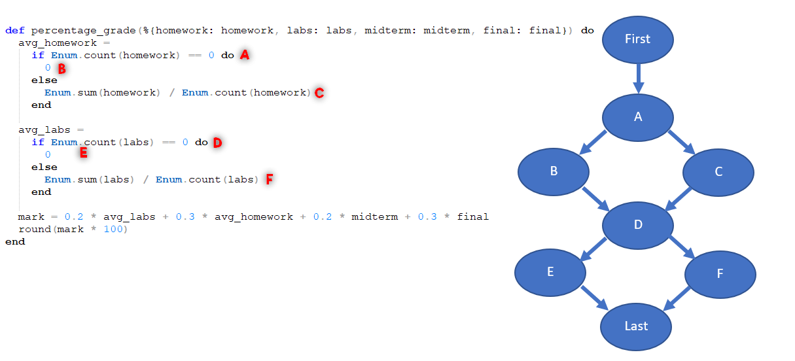
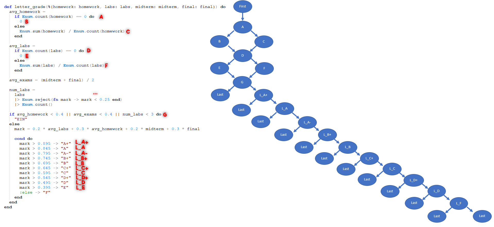

# Homework 2

| Outline | Value |
| --- | --- |
| Course | SEG 3103 |
| Date | Summer 2021 |
| Professor | Andrew Forward, aforward@uottawa.ca |
| Team | Guillaume Labasse 300132984 |

### Table of Contents  
[System & Environment](#system--environment)  
Answers:
* **[Question 1]**()  
	* [Question 1.1]()
	* [Question 1.2]()
	* [Question 1.3]()
	* [Question 1.4]()
* **[Question 2]**()  
	* [Question 2.1]()
	* [Question 2.2]()
	* [Question 2.3]()
	* [Question 2.4]()

   

### System & Environment

**OS**: Windows 10 
**Java**: 1.8.0_291 (Java 8) 
**JUnit**: 5 (via Standalone) 
**Eclipse**: 4.13.0 
**Elexir**: 1.12.0 (with Erlang 22.3)

   

## Question 1

### Question 1.1
For `percentage_grade()`:

For `letter_grade()`:

For `numeric_grade()`:

\*\*\*: While the `reject` method includes both a loop and a conditional, it still all belongs to one node according to [the teacher](https://piazza.com/class/knxg0zgsce5jp?cid=206). 

### Question 1.2
TODO

### Question 1.3
TODO

### Question 1.4
TODO

   

## Question 2

### Question 2.1
TODO

### Question 2.2
TODO

### Question 2.3
TODO

### Question 2.4
TODO
