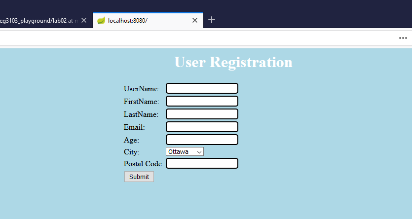
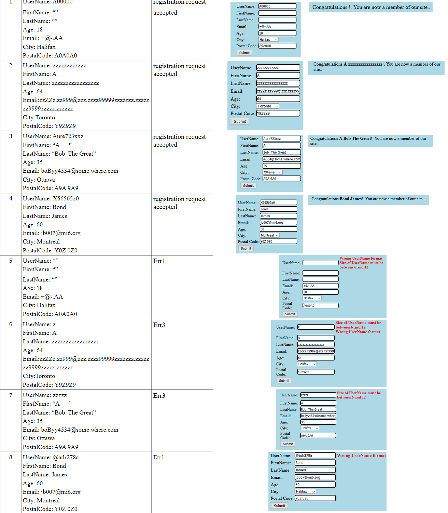
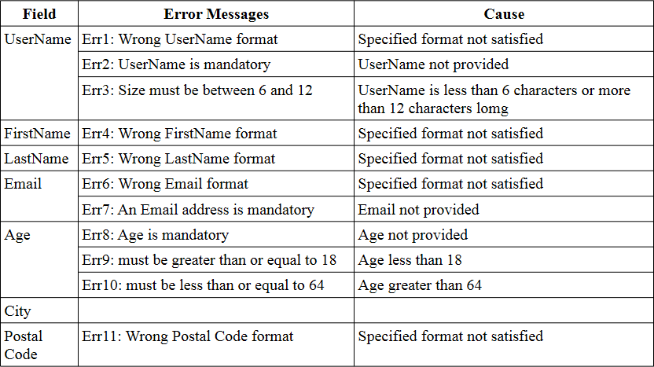
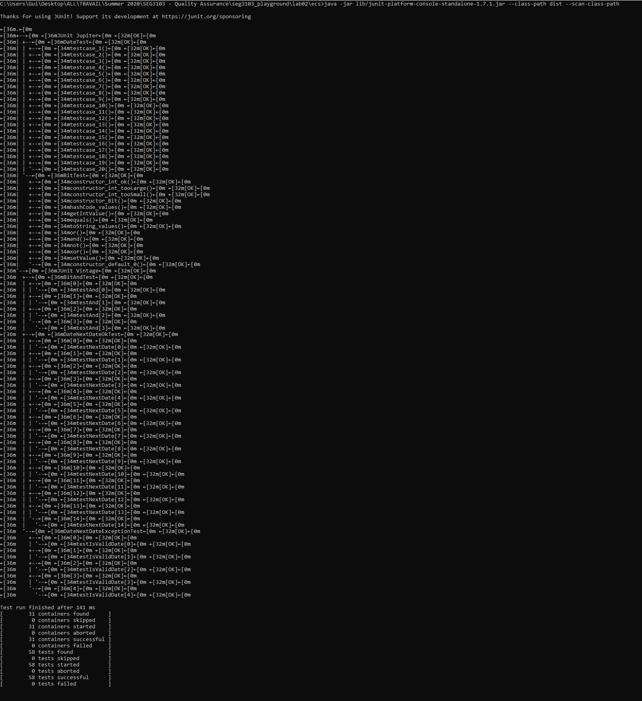

# Lab 2

| Outline | Value |
| --- | --- |
| Course | SEG 3103 |
| Date | Summer 2021 |
| Professor | Andrew Forward, aforward@uottawa.ca |
| Team | Guillaume Labasse 300132984 |

### Table of Contents  
[System & Environment](#system--environment)  
**Exercise 1**
* [Exercise 1 — Running Things](#exercise-1--running-things)  
* [Exercise 1 — Results](#exercise-1--results)

**Exercise 2**
* [Exercise 2 — Running Things](#exercise-2--running-things)  
* [Exercise 2 — Results](#exercise-2--results)

<br><br><br>

### System & Environment

**OS**: Windows 10<br>
**Java**: 1.8.0_291 (Java 8)<br>
**JUnit**: 5 (via Standalone)

<br><br><br>

### Exercise 1 — Running Things

I can run the webserver either by directly opening the jar or through the command prompt:

```bash
java -jar user-registration-app-0.1.0.jar
```

On [localhost:8080](localhost:8080), I can see:



<br><br><br>
### Exercise 1 — Results

Here's the output of the site for each of the sample test cases (both valid and invalid inputs):



We can associate the error messages to their error codes using this table:



To finally construct this table:


| Test Case | Expected Results | Actual Results | Verdict (Pass/Fail/Inconclusive) |
| --- | --- | --- | --- |
| 1 | Request succesful  | Request succesful | Pass |
| 2 | Request succesful  | Request succesful | Pass |
| 3 | Request succesful  | Request succesful | Pass |
| 4 | Request succesful  | Request succesful | Pass |
| 5 | Err1 | Err1, Err3 | Fail |
| 6 | Err3 | Err1, Err3 | Fail |
| 7 | Err3 | Err3 | Pass |
| 8 | Err1 | Err1 | Pass |

<br><br><br>

### Exercise 2 — Running Things

As with Lab 1, to compile and run the tests, we send (from the `ecs` folder):
```bash
$ javac -d dist -cp lib/junit-platform-console-standalone-1.7.1.jar src/*.java test/*.java
$ java -jar lib/junit-platform-console-standalone-1.7.1.jar --class-path dist --scan-class-path
```

We get this output:



### Exercise 2 — Results

From the output, we can conclude that both the explicit and parametrized tests we have written (for both valid and invalid input) are correct, and that the method thus behaves as expected. Have a good day!
