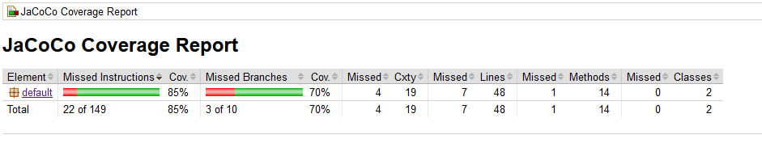
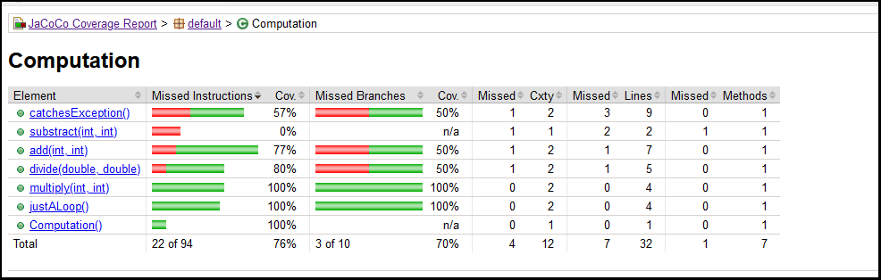
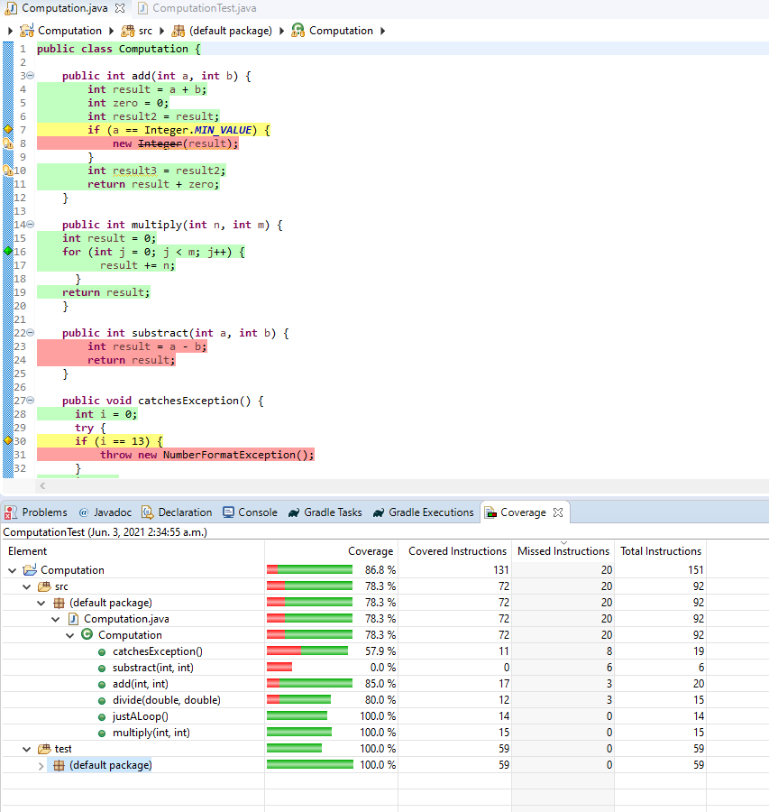

# Lab 3

| Outline | Value |
| --- | --- |
| Course | SEG 3103 |
| Date | Summer 2021 |
| Professor | Andrew Forward, aforward@uottawa.ca |
| Team | Guillaume Labasse 300132984 |

### Table of Contents  
[System & Environment](#system--environment)  
Lab Proceedings:
* [1 — Running Things](#1--running-things)  
* [2 — `Computations.java` Coverage](#2--computationsjava-coverage)
* [3 — Initial `Date.java` Coverage](#3--initial-datejava-coverage)  
* [4 — Improving `Date.java` Coverage](#4--improving-datejava-coverage)
* [5 — Refactoring `Date.java`](#5--refactoring-datejava)
* [6 — Final `Date.java` Coverage & Analysis](#6--final-datejava-coverage--analysis)

<br><br><br>

### System & Environment

**OS**: Windows 10<br>
**Java**: 1.8.0_291 (Java 8)<br>
**JUnit**: 5 (via Standalone)<br>
**Eclipse**: 4.13.0<br>
**Jacoco**: 3.1.3

<br><br><br>

### 1 — Running Things

Let's first compile and run the tests for the provided programs.<br>
For `computation`:

``` bash
$ javac -d dist -cp lib/junit-platform-console-standalone-1.7.1.jar src/*.java test/*.java
$ java -jar lib/junit-platform-console-standalone-1.7.1.jar --class-path dist --scan-class-path
```


For `date`:

``` bash
$ javac -d dist -cp lib/junit-platform-console-standalone-1.7.1.jar src/*.java test/*.java
$ java -jar lib/junit-platform-console-standalone-1.7.1.jar --class-path dist --scan-class-path
```


All tests ran successfully. 

<br><br><br>
### 2 — `Computations.java` Coverage

For starters, let's run Jacoco from the command line using the provided commands:

``` bash
$ java -javaagent:lib/jacocoagent.jar -jar lib/junit-platform-console-standalone-1.7.1.jar --class-path dist --scan-class-path
```


``` bash
$ java -jar lib/jacococli.jar report jacoco.exec --classfiles dist --sourcefiles src --html report
```


The report was created in the `computation/report` folder and generated various files: coverage analysis of the class by the test, coverage of the test itself, the Java file with contextual highlighting indicating covered statements, and two main report files, one that links back to the coverage analysis and one that links to the highlighted class. 

Here's the two most relevant files:




From this, we can conclude that 15% of instructions and 30% of branches aren't covered, with the biggest misses being in the `catchesException` and `substract` methods (the latter not being covered at all). 

For the rest of this lab, we'll use the Jacoco Eclipse plugin.<br>Here's our results again in Eclipse:



**N.B.:** Interestingly, we obtain similar results, but not the exact same ones. Jacoco must work differently as a plugin than it does standalone, as even the total number of instructions is different in these reports (92 total instructions according to Jacoco Eclipse, 94 standalone). 

<br><br><br>
### 3 — Initial `Date.java` Coverage

<br><br><br>
### 4 — Improving `Date.java` Coverage

<br><br><br>
### 5 — Refactoring `Date.java`

<br><br><br>
### 6 — Final `Date.java` Coverage & Analysis