# Lab 3

| Outline | Value |
| --- | --- |
| Course | SEG 3103 |
| Date | Summer 2021 |
| Professor | Andrew Forward, aforward@uottawa.ca |
| Team | Guillaume Labasse 300132984 |

### Table of Contents  
[System & Environment](#system--environment)  
Lab Proceedings:
* [1 — Running Things](#1--running-things)  
* [2 — `Computations.java` Coverage](#2--computationsjava-coverage)
* [3 — Initial `Date.java` Coverage](#3--initial-datejava-coverage)  
* [4 — Improving `Date.java` Coverage](#4--improving-datejava-coverage)
* [5 — Refactoring `Date.java`](#5--refactoring-datejava)
* [6 — Final `Date.java` Coverage & Analysis](#6--final-datejava-coverage--analysis)

<br><br><br>

### System & Environment

**OS**: Windows 10<br>
**Java**: 1.8.0_291 (Java 8)<br>
**JUnit**: 5 (via Standalone)<br>
**Eclipse**: 4.13.0<br>
**Jacoco**: 3.1.3

<br><br><br>

### 1 — Running Things

<details>
<summary>Click to expand!</summary>

<br>Let's first compile and run the tests for the provided programs.<br>
For `computation`:

``` bash
$ javac -d dist -cp lib/junit-platform-console-standalone-1.7.1.jar src/*.java test/*.java
$ java -jar lib/junit-platform-console-standalone-1.7.1.jar --class-path dist --scan-class-path
```


For `date`:

``` bash
$ javac -d dist -cp lib/junit-platform-console-standalone-1.7.1.jar src/*.java test/*.java
$ java -jar lib/junit-platform-console-standalone-1.7.1.jar --class-path dist --scan-class-path
```


All tests ran successfully. 
</details>

<br><br><br>
### 2 — `Computations.java` Coverage

<details>
<summary>Click to expand!</summary>

<br>For starters, let's run Jacoco from the command line using the provided commands:

``` bash
$ java -javaagent:lib/jacocoagent.jar -jar lib/junit-platform-console-standalone-1.7.1.jar --class-path dist --scan-class-path
```

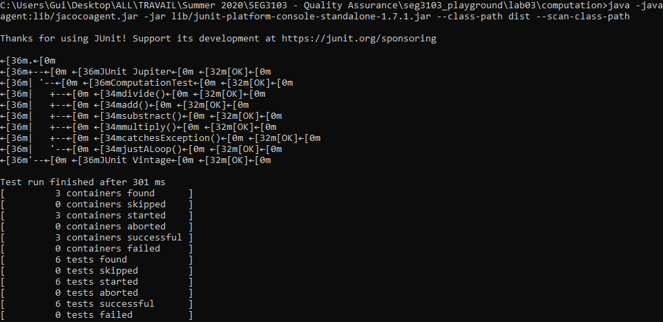

``` bash
$ java -jar lib/jacococli.jar report jacoco.exec --classfiles dist --sourcefiles src --html report
```

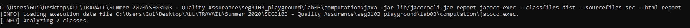

The report was created in the `computation/report` folder and generated various files: coverage analysis of the class by the test, coverage of the test itself, the Java file with contextual highlighting indicating covered statements, and two main report files, one that links back to the coverage analysis and one that links to the highlighted class. 

Here's the two most relevant files:

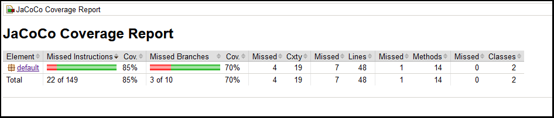
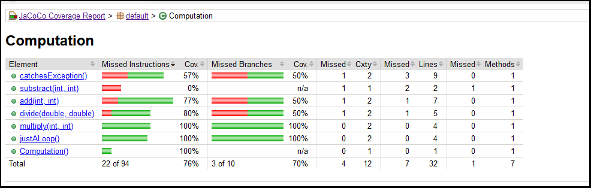

From this, we can conclude that 15% of instructions and 30% of branches aren't covered, with the biggest misses being in the `catchesException` and `substract` methods (the latter not being covered at all). 

For the rest of this lab, we'll use the Jacoco Eclipse plugin.<br>Here's our results again in Eclipse:

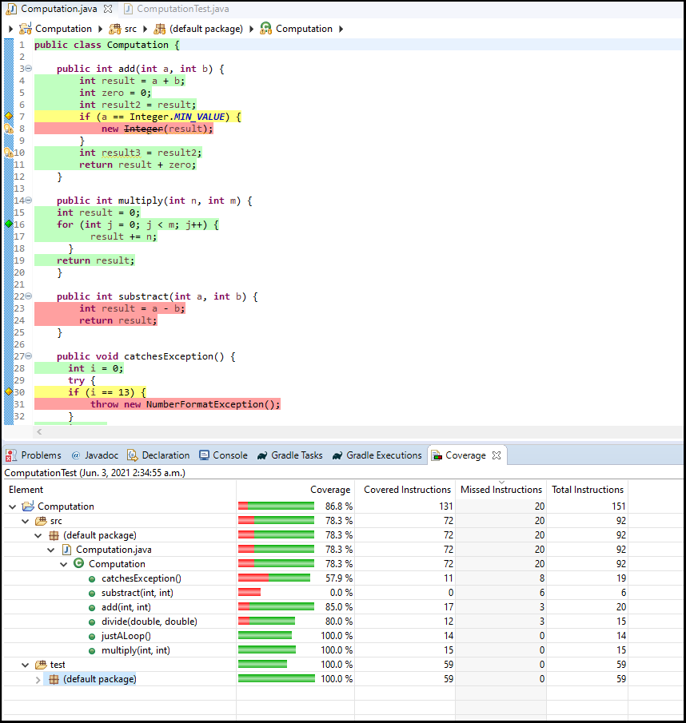

**N.B.:** Interestingly, we obtain similar results, but not the exact same ones. Jacoco must work differently as a plugin than it does standalone, as even the total number of instructions is different in these reports (92 total instructions according to Jacoco Eclipse, 94 on standalone). 
</details>

<br><br><br>
### 3 — Initial `Date.java` Coverage

<details>
<summary>Click to expand!</summary>

<br>Before changing anything in the `date` project, let's check the coverage of the given test suite:

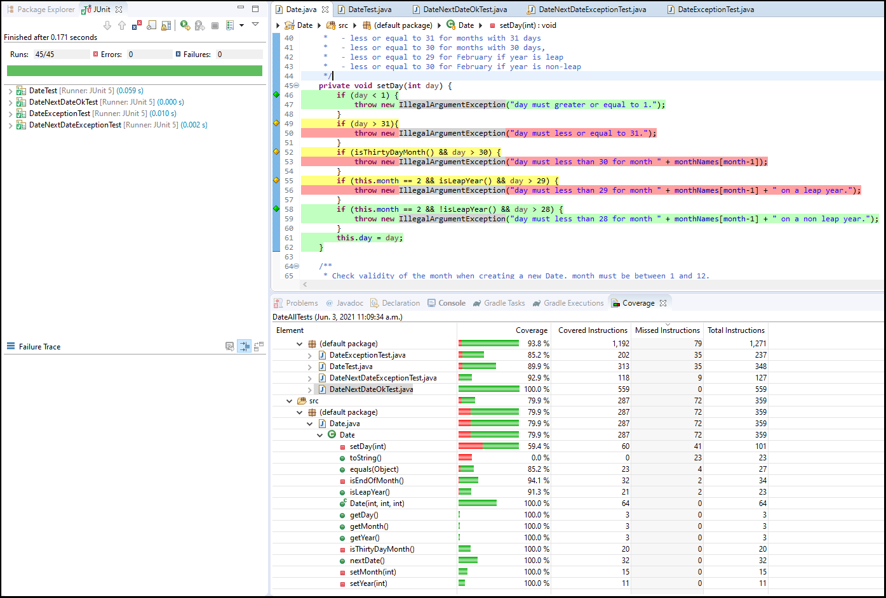

The coverage is about 80%. There's an interesting thing to note here: while the JUnit view (seen left) says all tests ran successfully, the coverage metrics show some tests didn't run *fully*. This is due to the way `assertThrows` and `expected=Exception` tests work (they do not have to run *fully* to run *successfully*, since they expect to be interrupted). I'll limit further screenshots to only the coverage view from now on.
</details>

<br><br><br>
### 4 — Improving `Date.java` Coverage
	
<details>
<summary>Click to expand!</summary>

<br>It's now time to improve the `Date.java` test suite coverage. I'll list the steps I took in the order I took them and conclude on whether 100% coverage is possible at the end. Assume that tests were ran successfully after each step. For the reasons stated in [the previous part](#3--initial-datejava-coverage), I will not try to improve the coverage of the test classes themselves and focus on `Date.java` coverage. 

1. **Delete redundant manual tests.** The `DateTest.java` class consists of manual tests which are already covered by the more efficient, elegant and organized parametrized test classes. We can safely delete it without lowering the coverage:

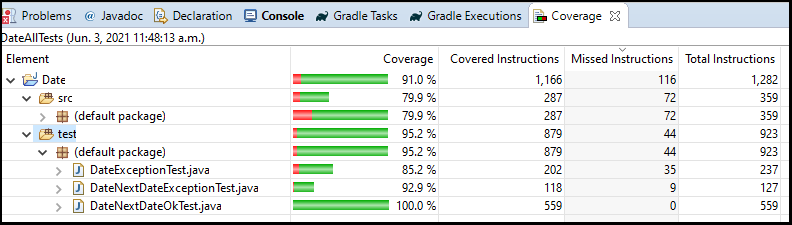

2. **Swap `DateExceptionTest` and `DateNextDateExceptionTest`, then delete the latter.** We can see that the given test files are swapped: `DateExceptionTest` is testing for an exception when calling `nextDate()`, while `DateNextDateExceptionTest` is testing for an exception when creating a new `Date`. The last 5 test cases from Lab 2 are really only checking whether instantiating invalid dates throws an exception (and not `nextDate()`); in fact, neither `nextDate` nor any method called by `nextDate` can throw an exception. We can thus delete `DateNextDateExceptionTest`. 

<table>
  <tr>
    <td>
    -
    </td>
    <td>
    DateExceptionTest
    </td>
    <td>
    DateNextDateExceptionTest
    </td>
  </tr>
  <tr>
    <td>
    Before
    </td>
    <td>
    <pre lang="java">
    @Test(expected=IllegalArgumentException.class)
    public void tests(){
      Date date = new Date(year,month,day);
      Date next = date.nextDate();
      Assert.assertEquals(expectedYear, next.getYear());
      Assert.assertEquals(expectedMont, next.getMonth());
      Assert.assertEquals(expectedDay, next.getDay());
    }</pre>
    </td>
    <td>
    <pre lang="java">
    @Test(expected = IllegalArgumentException.class)
    public void testNextDate(){
      new Date(year, month, day);
    }</pre>
    </td>
  </tr>
  <tr>
    <td>
    After
    </td>
    <td>
    <pre lang="java">
    @Test(expected = IllegalArgumentException.class)
    public void testValidDate() {
      new Date(year, month, day);
    }</pre>
    </td>
    <td>-</td>
  </tr>
</table>

3. **Adding test cases for `setDay` and `setMonth` in `DateExceptionTest`**. Branch and condition testing for these methods was incomplete and not all exceptions were thrown, so I added 4 test cases to remedy that. I also removed the `y=1500, m=02, d=31` test as it was equivalent to the `y=1500, m=02, d=29` test. 100% coverage for these methods was achieved.

4. **Adding test cases for `isEndOfMonth` and `isThirtyDayMonth` in `DateNextDateOkTest`**. `isEndOfMonth` is conditional on `nextDate` running, and `isThirtyDayMonth` is conditional on `isEndOfMonth` running. I added 3 test cases to cover unexplored branches and reached 100% coverage of the second method, however the first proved **impossible**. To achieve full condition coverage, I would need a situation with `month=2`, `day=29` and `leap=false`. This would be an invalid date and would thus throw an exception, disallowing me from running `nextDate`.

5. **Adding test cases for `isLeapYear` in `DateNextDateOkTest` and `toString` in `DateMiscTest`**. A couple miscellaneous methods that weren't fully covered. For organization purposes, I implemented my `toString` test as a manual test in a seperate class.

6. **Adding test cases for `equals` in `DateMiscTest`**. To finish off, a few test cases were needed for when compared dates weren't equal. Since they didn't fit in with our other tests, these were also put in `DateMiscTest`. 

In the end, **100% instruction coverage of `Date.java` was achieved**, but one branch was missed due to the above stated reason and could not be covered.

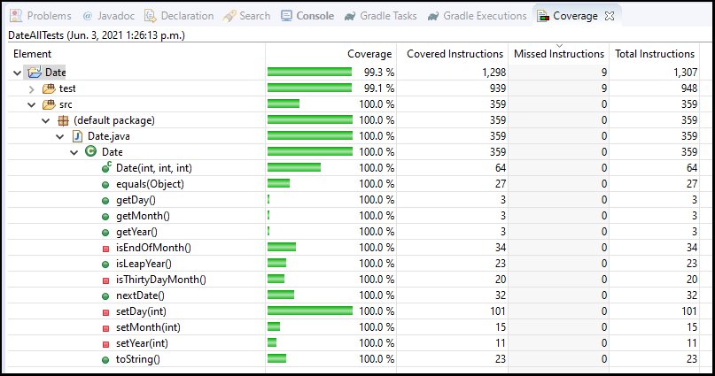
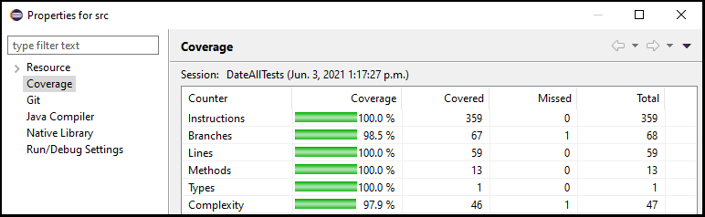
</details>

<br><br><br>
### 5 — Refactoring `Date.java`
	
<details>
<summary>Click to expand!</summary>

<br>Like in part 4, I'll go through my steps refactoring `Date.java` and show relevant snippets.<br>Analysis will be done in part 6.

1. **Style changes**. Various style changes were applied to improve code readability, such as the use of one-line ifs where applicable, removing redundant `this` keywords and more consistant spacing.

2. **Storing `isLeap` and `isThirtyDayMonth` boolean fields**. Calculating whether the year is a leap year or the month a 30 day month several times over an object's lifetime is inefficient; these will now be calculated once during instantiation. `isLeapYear` and `isThirtyDayMonth` were removed and methods were changed to use these value instead. **N.B.:** `isEndOfMonth` could be replaced for a similar reason, but it does help code readability and is useless to calculate and store for objects not expected to call `nextDate`. 

3. **Refactoring `isEndOfMonth`**. Changes were made to make better use of the `return` statement and the ternary operator was introduced for readability purposes. 

<table>
  <tr>
    <td>
		Before
    </td>
    <td>
		After
    </td>
  </tr>
  <tr>
    <td>
	<pre lang="java">
private boolean isEndOfMonth() {
  boolean leap = isLeapYear();
  if (day == 31 || (day == 30 && isThirtyDayMonth()) ||
    (this.month == 2 && ((day == 29 && leap) || (day == 28 && !leap))))
      return true;
  else return false;
}</pre>
    </td>
    <td>
	<pre lang="java">
private boolean isEndOfMonth() {
  return day == 31 || (day == 30 && isThirtyDayMonth) || (month == 2 && (isLeapYear ? day == 29 : day == 28));
}</pre>
    </td>
  </tr>
</table>
</details>

<br><br><br>
### 6 — Final `Date.java` Coverage & Analysis
	
<details>
<summary>Click to expand!</summary>

<br>After refactoring, **complete 100% coverage of `Date.java` was achieved** for both instructions and branches:

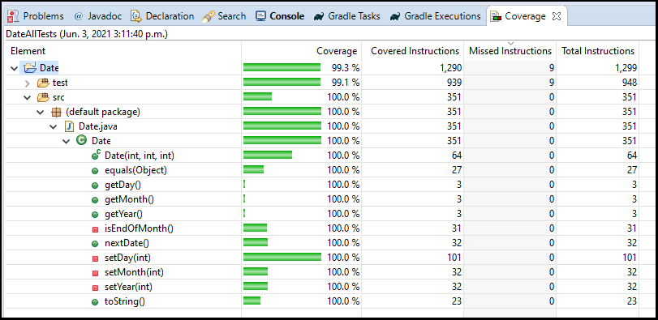
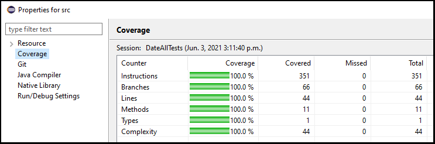

My branch coverage improved from 98.5% to 100%.<br>Refactoring the `isEndOfMonth` method in the way that I did eliminated our missing branch problem. Due to ternary logic, the program no longer needed to test for `day == 29` for non-leap years; if `isLeapYear == false`, it would only evaluate `day == 28`. We can thus conclude that 100% total coverage is possible, so long as practically impossible branches are eliminated from consideration. Have a great day!
</details>
