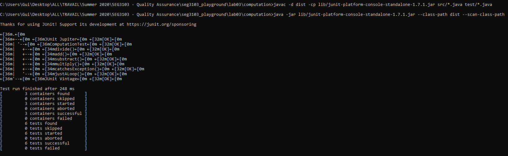
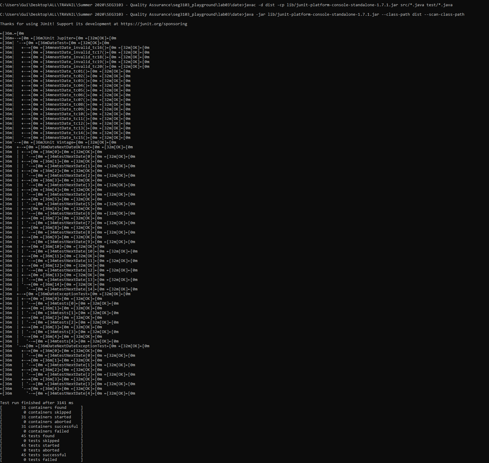

# Lab 3

| Outline | Value |
| --- | --- |
| Course | SEG 3103 |
| Date | Summer 2021 |
| Professor | Andrew Forward, aforward@uottawa.ca |
| Team | Guillaume Labasse 300132984 |

### Table of Contents  
[System & Environment](#system--environment)  
Lab Proceedings:
* [1 — Running Things]()  
* [2 — `Computations.java` Coverage]()
* [3 — `Date.java` Coverage]()  
* [4 — Improving `Date.java` Coverage]()
* [5 — Refactoring `Date.java`]()
* [6 — Final `Date.java` Coverage & Analysis]()

<br><br><br>

### System & Environment

**OS**: Windows 10<br>
**Java**: 1.8.0_291 (Java 8)<br>
**JUnit**: 5 (via Standalone)
**Jacoco**: TODO

<br><br><br>

### 1 — Running Things

Let's first compile and run the tests for the provided programs.
For `computation`:

``` bash
$ javac -d dist -cp lib/junit-platform-console-standalone-1.7.1.jar src/*.java test/*.java
$ java -jar lib/junit-platform-console-standalone-1.7.1.jar --class-path dist --scan-class-path
```



For `date`:

``` bash
$ javac -d dist -cp lib/junit-platform-console-standalone-1.7.1.jar src/*.java test/*.java
$ java -jar lib/junit-platform-console-standalone-1.7.1.jar --class-path dist --scan-class-path
```




### 2 — `Computations.java` Coverage

### 3 — `Date.java` Coverage

### 4 — Improving `Date.java` Coverage

### 5 — Refactoring `Date.java`

### 6 — Final `Date.java` Coverage & Analysis