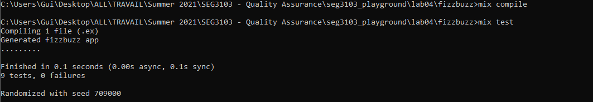
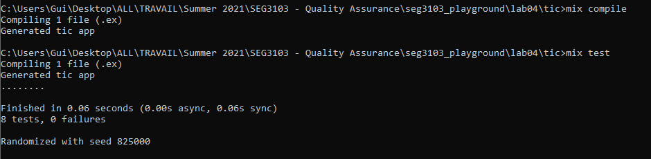

# Lab 3

| Outline | Value |
| --- | --- |
| Course | SEG 3103 |
| Date | Summer 2021 |
| Professor | Andrew Forward, aforward@uottawa.ca |
| Team | Guillaume Labasse 300132984 |

### Table of Contents  
[System & Environment](#system--environment)  
Lab Proceedings:
* [1 — Running Things](#1--running-things)  
* [2 — Chosen Project](#2--chosen-project)
* [3 — Highlights & Conclusion](#3--highlights--conclusion)  

<br><br><br>

### System & Environment

**OS**: Windows 10<br>
**Java**: 1.8.0_291 (Java 8)<br>
**JUnit**: 5 (via Standalone)<br>
**Eclipse**: 4.13.0<br>
**Elexir**: 1.12.0 (with Erlang 22.3)

<br><br><br>

### 1 — Running Things

<details>
<summary>Click to expand!</summary>

<br>Let's first compile and run the tests for the provided programs.<br>
For `fizzbuzz`:

``` bash
$ mix compile
$ mix test
```



For `tic`:

``` bash
$ mix compile
$ mix test
```



All tests ran successfully. 
</details>

<br><br><br>
### 2 — Chosen Project

<details>
<summary>Click to expand!</summary>

<br>Not done deciding which project to do...
</details>

<br><br><br>
### 3 — Highlights & Conclusion

<details>
<summary>Click to expand!</summary>

<br>TODO
</details>
