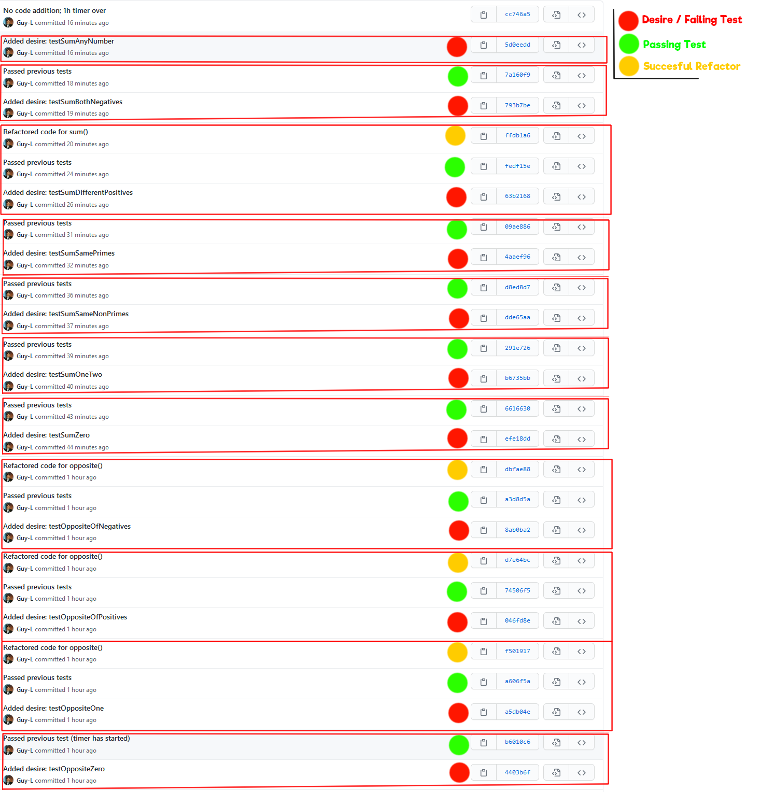

# Lab 4

| Outline | Value |
| --- | --- |
| Course | SEG 3103 |
| Date | Summer 2021 |
| Professor | Andrew Forward, aforward@uottawa.ca |
| Team | Guillaume Labasse 300132984 |

### Table of Contents  
[System & Environment](#system--environment)  
Lab Proceedings:
* [1 — Running Things](#1--running-things)  
* [2 — Chosen Project](#2--chosen-project)
* [3 — Highlights & Conclusion](#3--highlights--conclusion)  

<br><br><br>

### System & Environment

**OS**: Windows 10<br>
**Java**: 1.8.0_291 (Java 8)<br>
**JUnit**: 5 (via Standalone)<br>
**Eclipse**: 4.13.0<br>
**Elexir**: 1.12.0 (with Erlang 22.3)

<br><br><br>

### 1 — Running Things

<details>
<summary>Click to expand!</summary>

<br>Let's first compile and run the tests for the provided programs.<br>
For `fizzbuzz`:

``` bash
$ mix compile
$ mix test
```


For `tic`:

``` bash
$ mix compile
$ mix test
```


All tests ran successfully. 
</details>

<br><br><br>
### 2 — Chosen Project

<details>
<summary>Click to expand!</summary>

<br>I had trouble deciding which problem to do. I thought FizzBuzz was too simple to take an hour, and wasn't sure exactly what the requirements were for TicTacToe, so I came up with my own program idea. This allows me to set clear goals to work towards, and add additional goals if necessary. I hope this is okay!

The idea is to make a custom calculator which uses strange alternative arithmetic rules. These rules are not consistent throughout, we just want to meet our specifications. The specification are as follows:
	
- **Calculating the opposite of a number**: the opposite of a number in our system is its reverse in decimal notation, times -1 (e.g. 51 = -15, 307 = -703, -54 = 45).
	
- **Calculating the sum of two numbers**: the sum of two numbers is the (regular) sum of all primes between the two numbers, inclusively (e.g. 10+16 = 24 since 11 and 13 are between).
	
- **Calculating the max between two numbers**: the max between two numbers is the number which has the most divisors (e.g. max(30, 32) = 30)
	
- **Calculating the product of two positive numbers**: the product of two numbers is the square root their concatenation (e.g. 2✕5 = 5, 5✕2 = 7.2111...)
	
I'll take things step by step using the TDD method, and hopefully these requirements will be enough to do a full hour of work.<br>If not, this section will be edited to add some more goals.
</details>

<br><br><br>
### 3 — Highlights & Conclusion

<details>
<summary>Click to expand!</summary>

<br>Well! I overestimated my time by quite a lot. In the end, I was able to complete the `opposite()` method to satisfaction and most of the `sum()` method; however the final desire (summing ANY two numbers) will not work due to two remaining issues: not correctly handling negative numbers, and requiring `RHS > LHS` for the method to work (which is not part of the specifications). The former would have been fixed by changing the `if(i==1) continue;` prime-checking corner case into `if(i<1) continue;`, the latter by checking which number is greater at the beginning and using that as the `for` loop's upper bound. Of course, I knew this from the get go, but the TDD approach required me to proceed more cautiously. Overall, I believe this (very exaggerated) approach is quite inefficient; the code I wrote in an hour with TDD would have taken me at most 15 minutes to produce normally. 
	
I wasn't sure how commits were to be grouped (chronologically or by type), so I did both:

#### Chronologically


#### By type

| Desire / Failing Test | Passing Test | Refactors |
| --- | --- | --- |
| [4403b6f](https://github.com/Guy-L/seg3103_playground/commit/4403b6f62d7dba7a27e22c24954cb84e9faa888c#diff-98a7664850e11b789c8412406510f24ca0256b27d1e7f8e57df872e298df35da)<br>[a5db04e](https://github.com/Guy-L/seg3103_playground/commit/a5db04ee4d459aaf033db07a12036d09f5c23933#diff-98a7664850e11b789c8412406510f24ca0256b27d1e7f8e57df872e298df35da)<br>[046fd8e](https://github.com/Guy-L/seg3103_playground/commit/046fd8ede5d31906e6ba0c3a28ea3abc49cb9845#diff-98a7664850e11b789c8412406510f24ca0256b27d1e7f8e57df872e298df35da)<br>[8ab0ba2](https://github.com/Guy-L/seg3103_playground/commit/8ab0ba29e4d6e8216b26714c7acf4c0334c85bfe#diff-98a7664850e11b789c8412406510f24ca0256b27d1e7f8e57df872e298df35da)<br>[efe18dd](https://github.com/Guy-L/seg3103_playground/commit/efe18dd202a88a688119eae5143ee84946173c9e#diff-98a7664850e11b789c8412406510f24ca0256b27d1e7f8e57df872e298df35da)<br>[b6735bb](https://github.com/Guy-L/seg3103_playground/commit/b6735bb1a4a846262749d730fab3fa1125f2085b#diff-98a7664850e11b789c8412406510f24ca0256b27d1e7f8e57df872e298df35da)<br>[dde65aa](https://github.com/Guy-L/seg3103_playground/commit/dde65aa0deb07dd9b1b9cdff0149261875e9e299#diff-98a7664850e11b789c8412406510f24ca0256b27d1e7f8e57df872e298df35da)<br>[4aaef96](https://github.com/Guy-L/seg3103_playground/commit/4aaef96edf02968ebf139c573aba3b7e7598ba35#diff-98a7664850e11b789c8412406510f24ca0256b27d1e7f8e57df872e298df35da)<br>[63b2168](https://github.com/Guy-L/seg3103_playground/commit/63b2168a45e268163f566fc15616442548415899#diff-98a7664850e11b789c8412406510f24ca0256b27d1e7f8e57df872e298df35da)<br>[793b7be](https://github.com/Guy-L/seg3103_playground/commit/793b7be79bce711347cf6702d623bed6e4ced381#diff-98a7664850e11b789c8412406510f24ca0256b27d1e7f8e57df872e298df35da)<br>[5d0eedd](https://github.com/Guy-L/seg3103_playground/commit/5d0eedd755e057e2b7e1bc62fa8f292aa3aeb358#diff-98a7664850e11b789c8412406510f24ca0256b27d1e7f8e57df872e298df35da) | [b6010c6](https://github.com/Guy-L/seg3103_playground/commit/b6010c6b7c5689680e7724736a3299952cd1c7e2#diff-98a7664850e11b789c8412406510f24ca0256b27d1e7f8e57df872e298df35da)<br>[a606f5a](https://github.com/Guy-L/seg3103_playground/commit/a606f5a0b63f8a7b00d335da503e9dd574b7cbb4#diff-98a7664850e11b789c8412406510f24ca0256b27d1e7f8e57df872e298df35da)<br>[74506f5](https://github.com/Guy-L/seg3103_playground/commit/74506f5a389ed0a231037dd71c43716f0bd7ebad#diff-98a7664850e11b789c8412406510f24ca0256b27d1e7f8e57df872e298df35da)<br>[a3d8d5a](https://github.com/Guy-L/seg3103_playground/commit/a3d8d5a837c61b3dcaf350a978047f62df3dce10#diff-98a7664850e11b789c8412406510f24ca0256b27d1e7f8e57df872e298df35da)<br>[6616630](https://github.com/Guy-L/seg3103_playground/commit/6616630b5e306dd8dcc730e70fa09575ad3fea12#diff-98a7664850e11b789c8412406510f24ca0256b27d1e7f8e57df872e298df35da)<br>[291e726](https://github.com/Guy-L/seg3103_playground/commit/291e7264de420bed5db61fab2d070156d9f34101#diff-98a7664850e11b789c8412406510f24ca0256b27d1e7f8e57df872e298df35da)<br>[d8ed8d7](https://github.com/Guy-L/seg3103_playground/commit/d8ed8d7305647d026ce7bd316e6801b6c84eacaa#diff-98a7664850e11b789c8412406510f24ca0256b27d1e7f8e57df872e298df35da)<br>[09ae886](https://github.com/Guy-L/seg3103_playground/commit/09ae8864945067a945c9ecb37edab9b63cfbe360#diff-98a7664850e11b789c8412406510f24ca0256b27d1e7f8e57df872e298df35da)<br>[fedf15e](https://github.com/Guy-L/seg3103_playground/commit/fedf15eae35cb4157dc5399d6ff74e7274d482a7#diff-98a7664850e11b789c8412406510f24ca0256b27d1e7f8e57df872e298df35da)<br>[7a160f9](https://github.com/Guy-L/seg3103_playground/commit/7a160f92282a5ded0b6f4a2d23ed7fe93b9660f1#diff-98a7664850e11b789c8412406510f24ca0256b27d1e7f8e57df872e298df35da) | [f501917](https://github.com/Guy-L/seg3103_playground/commit/f501917d3b720c24bb6c01ecb64f9099812feea6#diff-98a7664850e11b789c8412406510f24ca0256b27d1e7f8e57df872e298df35da)<br>[d7e64bc](https://github.com/Guy-L/seg3103_playground/commit/d7e64bc0a2ebcbef5f2330334b6fe0ad5f27d7b1#diff-98a7664850e11b789c8412406510f24ca0256b27d1e7f8e57df872e298df35da)<br>[dbfae88](https://github.com/Guy-L/seg3103_playground/commit/dbfae88eb5d553851ff8b14e7a294c0bef220781#diff-98a7664850e11b789c8412406510f24ca0256b27d1e7f8e57df872e298df35da)<br>[ffdb1a6](https://github.com/Guy-L/seg3103_playground/commit/ffdb1a6ee74f884f60feb90bbe17138ffa998f5b#diff-98a7664850e11b789c8412406510f24ca0256b27d1e7f8e57df872e298df35da) |

Have a great day!

**N.B.**: I started the timer with commit #4403b6f, despite saying I did in commit #b6010c6 (the one immediately after). I'd simply forgotten to add that to the first commit message, hopefully that's not an issue (the total time spent is still exactly an hour regardless). 
	
</details>
