# Lab 5

| Outline | Value |
| --- | --- |
| Course | SEG 3103 |
| Date | Summer 2021 |
| Professor | Andrew Forward, aforward@uottawa.ca |
| Team | Guillaume Labasse 300132984 |

### Table of Contents  
[System & Environment](#system--environment)  
Lab Proceedings:
* [1 — Running Things](#1--running-things)  
* [A1 — Running the Site & Stubs](#A1--running-the-site--stubs)  
* [A2 — Using Assignment 2 Code & Observations](#A2--using-assignment-2-code--observations)  
* [B1 — Implementing the Test Cases]()  
* [B2 — Fixing `isMentionned`]()  

<br><br><br>

### System & Environment

**OS**: Windows 10<br>
**Java**: 1.8.0_291 (Java 8)<br>
**JUnit**: 5 (via Standalone)<br>
**Elexir**: 1.12.0 (with Erlang 22.3)

<br><br><br>

### 1 — Running Things

<details>
<summary>Click to expand!</summary>

<br>Let's first compile and run the tests for the provided programs.<br>
For `grades`:

``` bash
$ mix compile
$ mix test
```

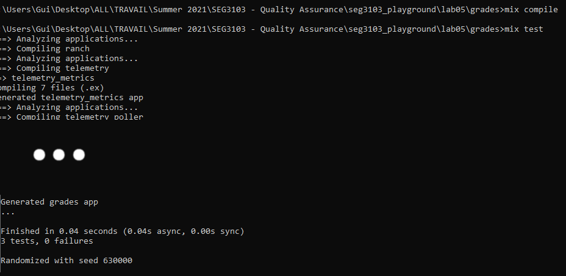

I had a lot of difficulties figuring out how to do this next part as the slides gave no precise indications; I had to ask for help. For example, one of the libraries necessary to run these tests from the command line, Objenesis, was never mentioned (though it was included).
For `twitter`:

``` bash
$ javac -d dist -cp lib/easymock-4.3.jar;lib/junit-platform-console-standalone-1.7.1.jar src/*.java test/*.java
$ java -jar lib/junit-platform-console-standalone-1.7.1.jar --class-path "lib/easymock-4.3.jar;lib/objenesis-3.2.jar;dist" --scan-class-path
```

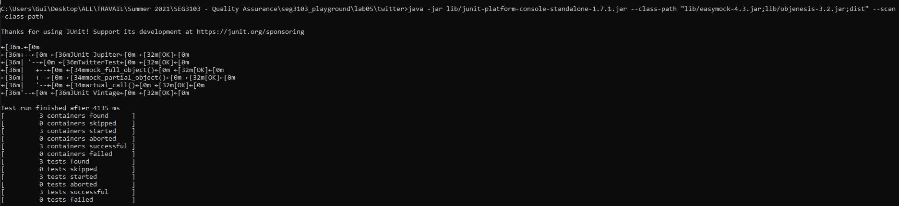

All tests ran successfully. 
</details>

<br><br><br>

### A1 — Running the Site & Stubs

<details>
<summary>Click to expand!</summary>

After doing the setup as described by the slides, I run:

```bash
$ mix phx.server 
```

And I can see the site up on the port specified by `config/dev.exs`:

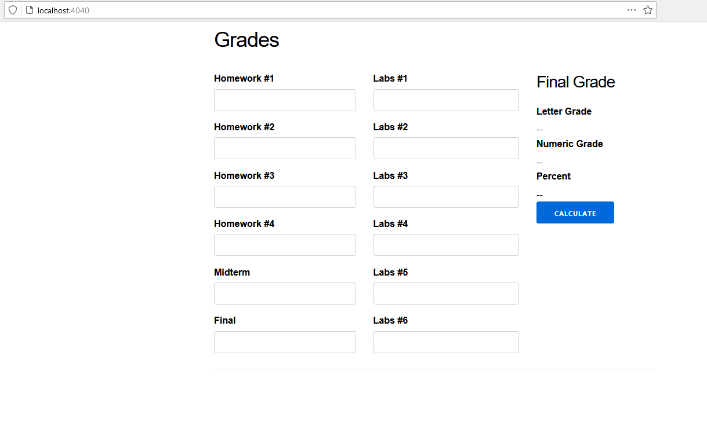

As expected, clicking the Calculate button causes server-side errors due to undefined functions:

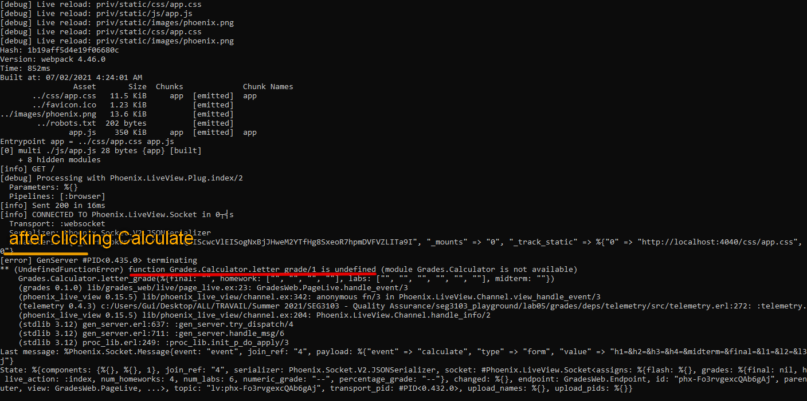

To fix these errors, I implement method stubs in [`calculator.ex`](https://github.com/Guy-L/seg3103_playground/commit/c26195b25a8fa4a73ccff39f64c10f2f42fc4cda#diff-68c01fac5a076d8f3fe2835cdfd8c3f0299804dca4b6e4b3e0f51c7ef062376b):

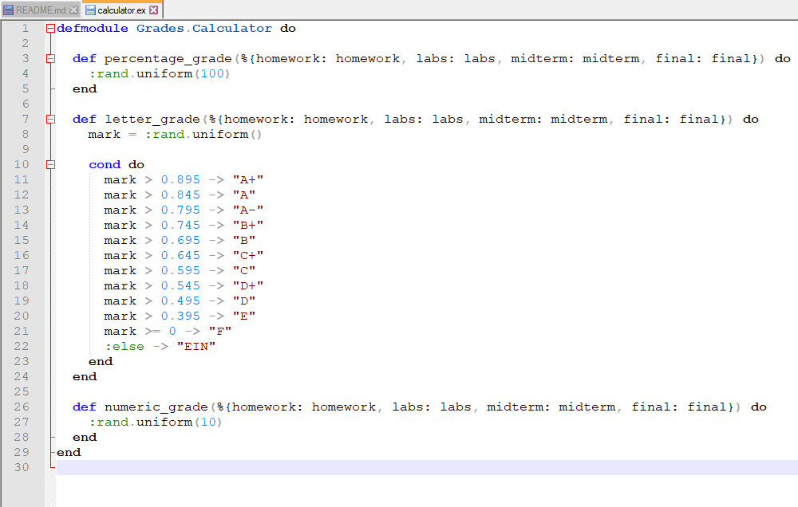
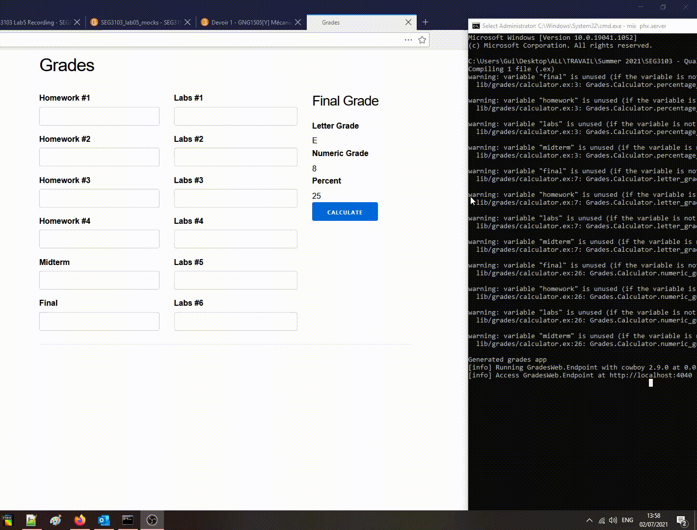
</details>

<br><br><br>

### A2 — Using Assignment 2 Code & Observations

<details>
<summary>Click to expand!</summary>

I then [substitute in](https://github.com/Guy-L/seg3103_playground/blob/98647f9a1106d71cc617d25e6cc8445f13530c92/lab05/grades/lib/grades/calculator.ex) my refactored Assignment 2 code:

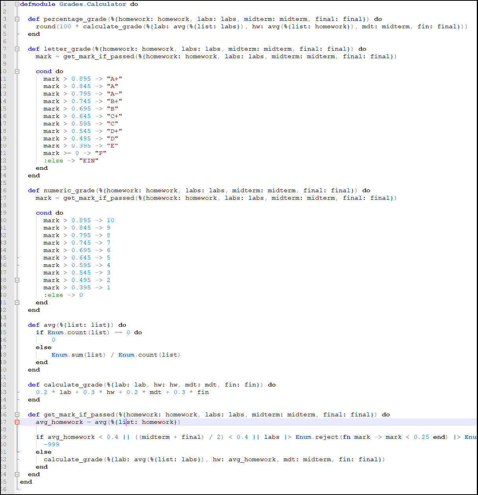

After restarting the site, clicking the Calculate button yields a new error:

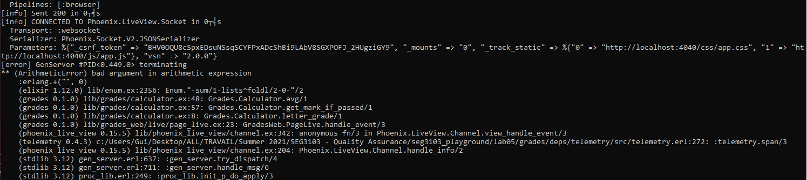

We see an ArithmeticError which occurs on this line:

```
	Enum.sum(list) / Enum.count(list)
```

It's hard to tell from the Elixir error syntax, but it seems the error specifically occurs when attempting to sum the provided list. From the stack trace, we can tell that the list in question is the Homework grades list, since its average is calculated on line 57. I conclude that there must be a fault with the code responsible for calling the calculator methods with the user-provided values, which either sends an empty list or an otherwise invalid one. We did not observe these errors when working with stubs as the input values were left completely  unused (as warned by Elixir in the gif above).
</details>

<br><br><br>
 
### B1 — Implementing the Test Cases

I first implement the test cases as described by the comments using partial mock objects:

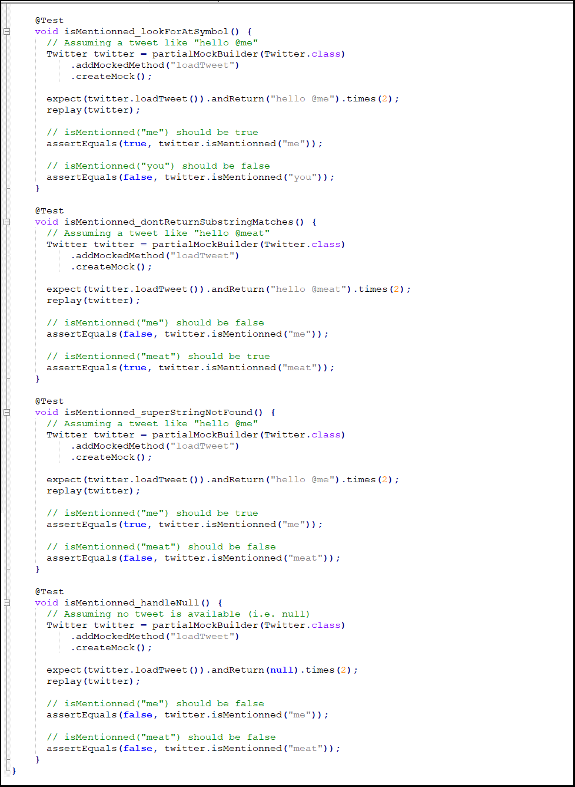

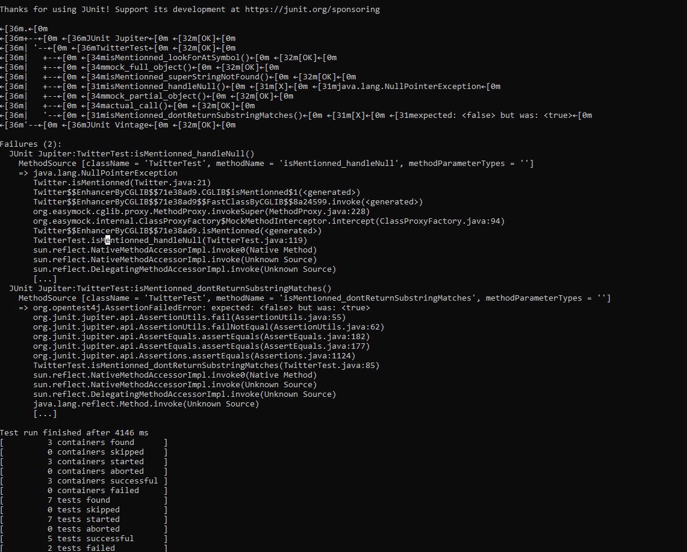

We can see two failures, which both have to do with the underlying implementation of `isMentionned()`. 

```java
public boolean isMentionned(String name) {
    String tweet = loadTweet();
    return tweet.contains("@" + name);
}
```

Firstly, this method cannot handle null `tweet`s as it will attempt to call a String method no matter what, causing a `NullPointerException`. 
Secondly, this method cannot handle substring matches and will return true if it finds *any* match, even if this match is part of another mention.
Finally, we can randomly see the `actual_call` test failing as it uses the real implementation of `loadTweet`, which functions randomly. I believe this test case is only here to showcase the difference between actual calls and mock calls (rather than an actual program specification), thus I will not attempt to make it pass consistently. 


### B2 — Fixing `isMentionned`

To fix these issues, here is my new `isMentionned()` code:

```java
public boolean isMentionned(String name) {
	String tweet = loadTweet();
	if(tweet == null) return false; 
	
	tweet = tweet.substring(tweet.indexOf("@")+1);
	if(tweet.contains(" ")) tweet = tweet.substring(0, tweet.indexOf(" "));
	
	return tweet.equals(name);
}
```

The code now instantly returns false is a null tweet is obtained. It also properly considers the entire "mention" substring by comparing the entire string starting after the @ symbol (and ending after the next space, if any) to the given name. 

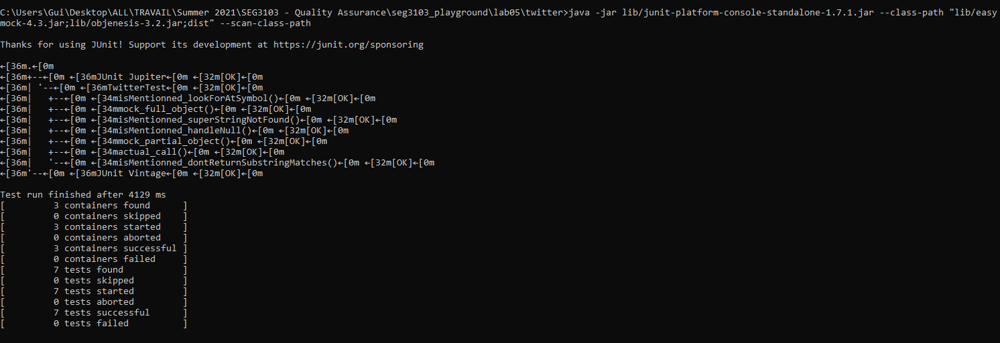

The tests now pass succesfully. 