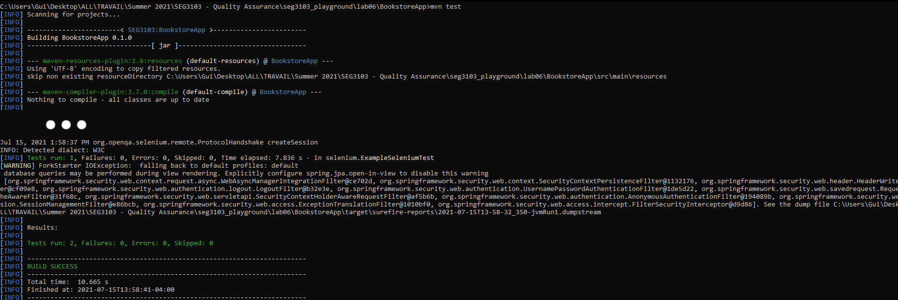

# Lab 6

| Outline | Value |
| --- | --- |
| Course | SEG 3103 |
| Date | Summer 2021 |
| Professor | Andrew Forward, aforward@uottawa.ca |
| Team | Guillaume Labasse 300132984 |

### Table of Contents  
[System & Environment](#system--environment)  
Lab Proceedings:
* [1 — Running Things](#1--running-things)  
* [2 — Writing a Selenium Test](#2--writing-a-selenium-test)  
<br><br><br>

### System & Environment

**OS**: Windows 10<br>
**Java**: 1.8.0_261 (Java 8)<br>
**JUnit**: 5 (via Standalone)<br>
**Maven**: 3.8.1<br>
**GeckoDriver**: 0.29.1 (unused)<br>
**Firefox**: 89.0 (unused)<br>
**Chrome**: 91.0 

<br><br><br>

### 1 — Running Things

<details>
<summary>Click to expand!</summary>

<br>Let's go through the environment setup as described by the lab.<br>
First of all, I installed Maven 3.8.1:


Let's then compile the project: 


Then we package the application into a `.jar` file: 


Let's now run our newly packaged application: 


And on the browser, we see:


... Huh. Like [many others](https://piazza.com/class/knxg0zgsce5jp?cid=350), I wasn't succesful in running the packaged application as-is. I could run the base `bookstore5.jar` which was provided, but as [another student](https://piazza.com/class/knxg0zgsce5jp?cid=358) indicated, we are not meant to do this. Using the `.inheritIO()` fix, I see this after recompiling:


The server is now properly running.<br><br>
Finally, I run `mvn test`: 


All tests ran successfully.<br>
Note that ~~since my machine was a bit too slow, I had to run `mvn test` *while* running the server in another terminal - the test program did not finish creating a server quickly enough~~ I also had to add `.inheritIO()` to the test program's ProcessBuilder in order to run it correctly. Even when doing this, tests would not pass when using the Gecko driver, so despite Firefox being my preferred browser, I will be using Chrome. 

</details>

<br><br><br>

### 2 — Writing a Selenium Test

<details>
<summary>Click to expand!</summary>

<br>For this part, I have to choose a requirement from the provided document to convert into a Selenium test. Just to make sure, I chose to do a few requirements, going through a standard user story of ordering books and viewing the completed order. These requirements are, in order: **F2.2**, **F3**, **F4**, **F5**, **F5.1** & **F6**. Taking inspiration from other provided tests and iteratively improving/fixing my code, I write this test:

```java
@Test
public void orderingUpdatingTest(){
	driver.findElement(By.id("searchBtn")).click();
	driver.findElement(By.id("order-hall001")).click();
	driver.findElement(By.id("order-hall002")).click(); //we will remove this item before checkout
	driver.findElement(By.id("order-lewis001")).click(); //we will order two of this item
	driver.findElement(By.id("cartLink")).click();
	driver.findElement(By.id("hall002")).sendKeys("\b0" + Keys.TAB + Keys.ENTER);
	driver.findElement(By.id("lewis001")).sendKeys("\b2" + Keys.TAB + Keys.ENTER + Keys.TAB + Keys.ENTER);
	assertEquals("$104.22", driver.findElement(By.id("order_total")).getText());
	//(expected value obtained from going through the user story manually beforehand
}
```

I run `mvn test` one final time:



Note: other Selenium tests have been commented out.<br>
I see the webdriver going through the steps as intended, and the test passes succesfully.<br>Have a great day!
</details>
