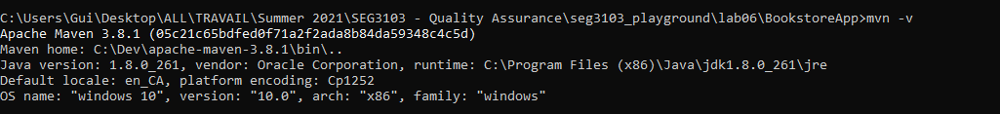
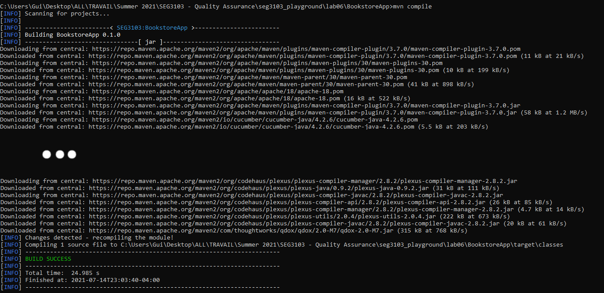
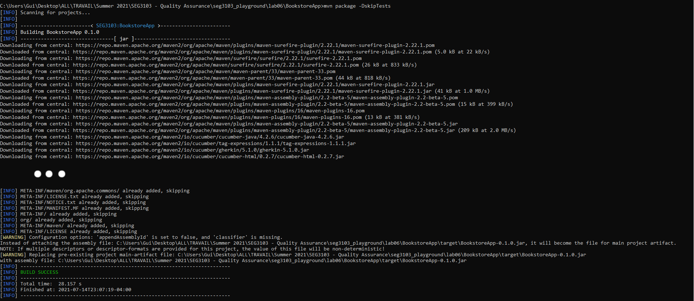
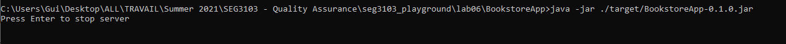
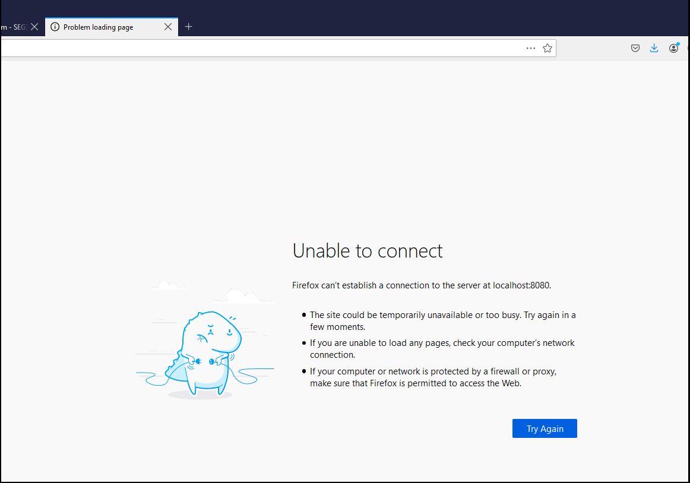
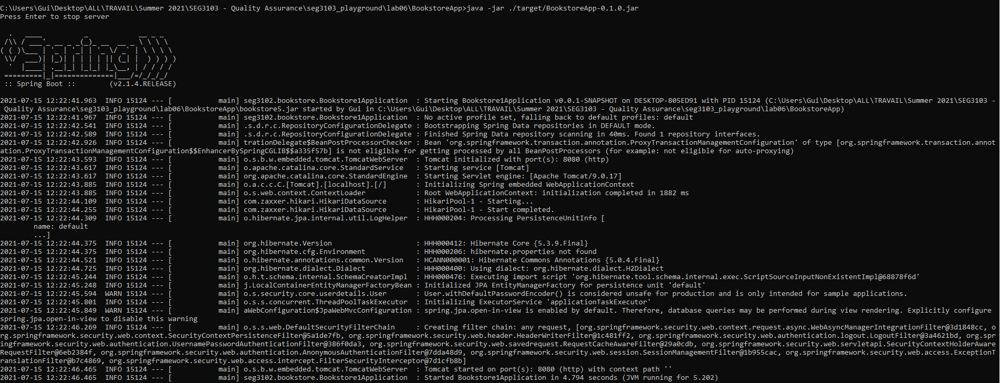
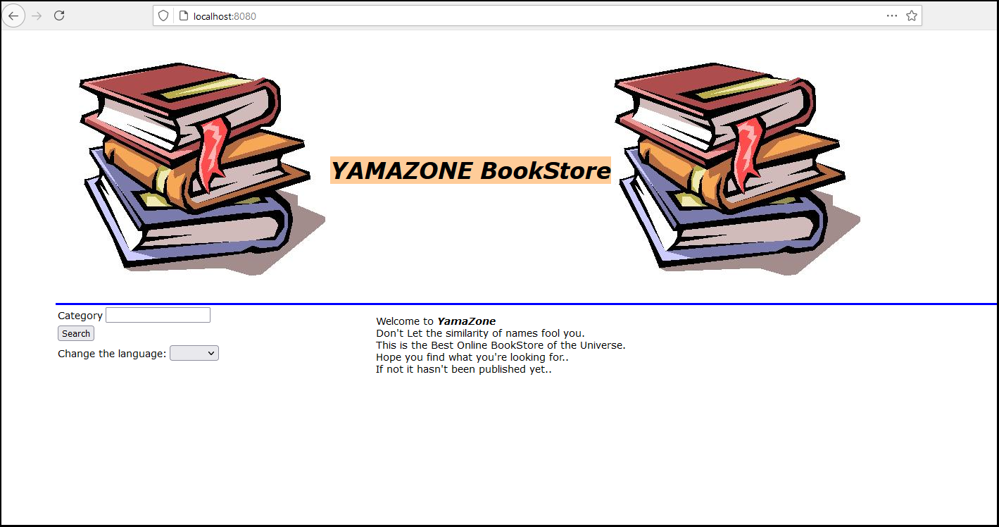
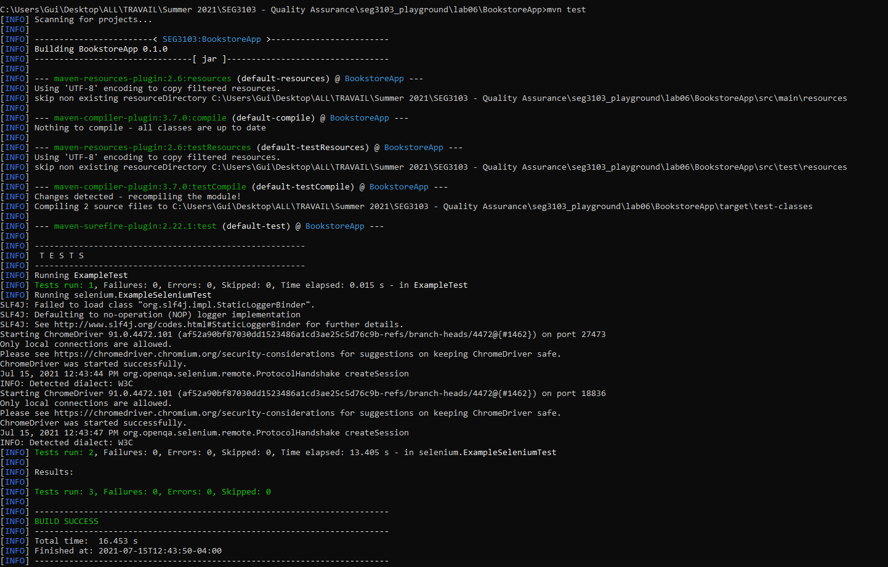

# Lab 6

| Outline | Value |
| --- | --- |
| Course | SEG 3103 |
| Date | Summer 2021 |
| Professor | Andrew Forward, aforward@uottawa.ca |
| Team | Guillaume Labasse 300132984 |

### Table of Contents  
[System & Environment](#system--environment)  
Lab Proceedings:
* [1 — Running Things](#1--running-things)  
* [2 — Writing a Selenium Test](#2--writing-a-selenium-test)  
   

### System & Environment

**OS**: Windows 10 
**Java**: 1.8.0_291 (Java 8) 
**JUnit**: 5 (via Standalone) 
**Maven**: 3.8.1
**GeckoDriver**: 0.29.1 (unused)
**Firefox**: 89.0 (unused)
**Chrome**: 91.0 

   

### 1 — Running Things

Click to expand!

Let's go through the environment setup as described by the lab. 
First of all, I installed Maven 3.8.1:

Let's then compile the project: 

Then we package the application: 

Finally, let's now run our newly packaged application: 

And on the browser, we see:

... Huh. Like [many others](https://piazza.com/class/knxg0zgsce5jp?cid=350), I wasn't succesful in running the packaged application as-is. I could run the base `bookstore5.jar` which was provided, but as [another student](https://piazza.com/class/knxg0zgsce5jp?cid=358) indicated, we are not meant to do this. Using the `.inheritIO()` fix, I see this after recompiling:

The server is now properly running. 
Finally, I run `mvn test`: 

All tests ran successfully. 
Note that since my machine was a bit too slow, I had to run `mvn test` *while* running the server in another terminal - the test program did not finish creating a server quickly enough. Even when doing this, tests would not pass when using the Firefox driver, so despite it being my preferred browser, I will be using Chrome. 

   

### 2 — Writing a Selenium Test

Click to expand!

blah

