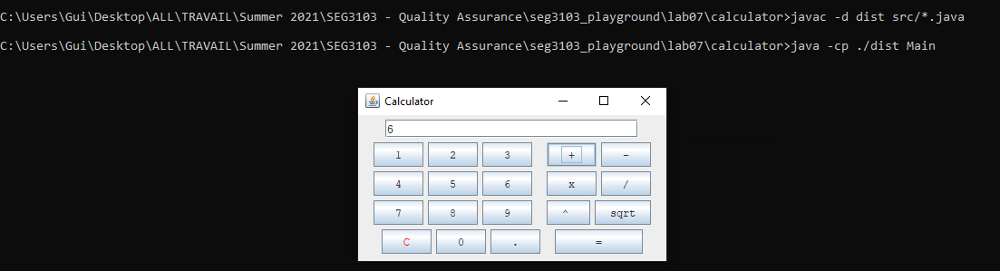
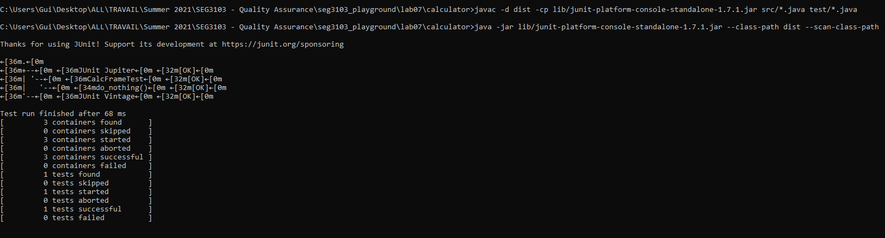
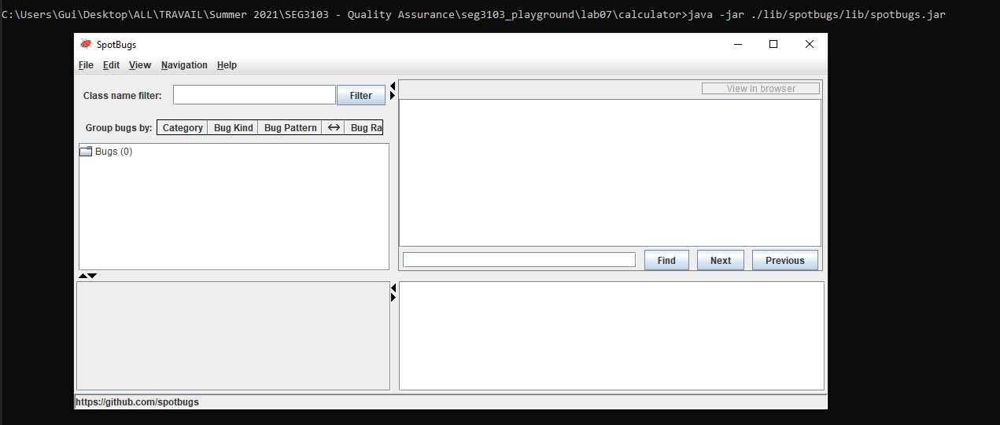
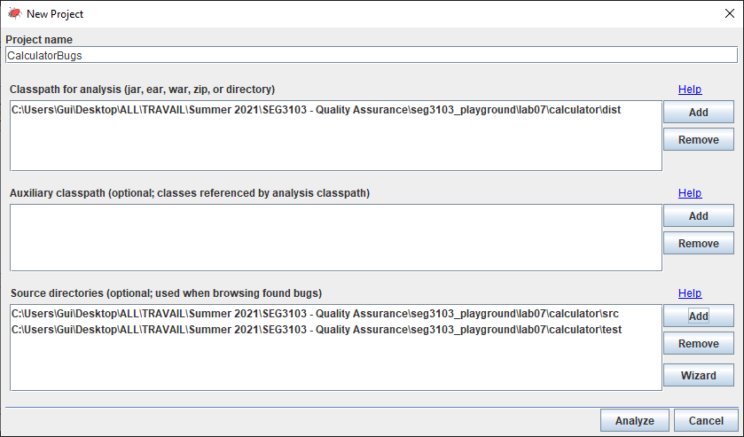
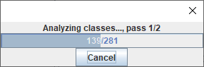
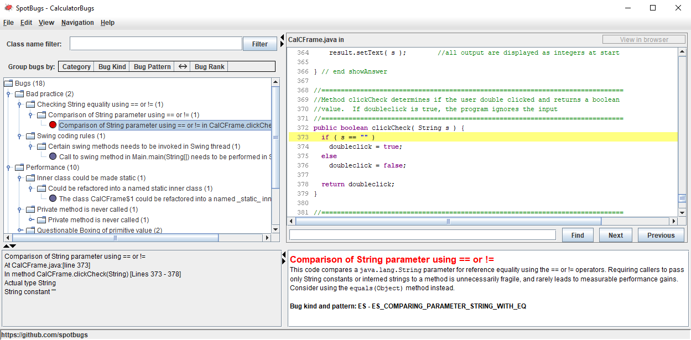
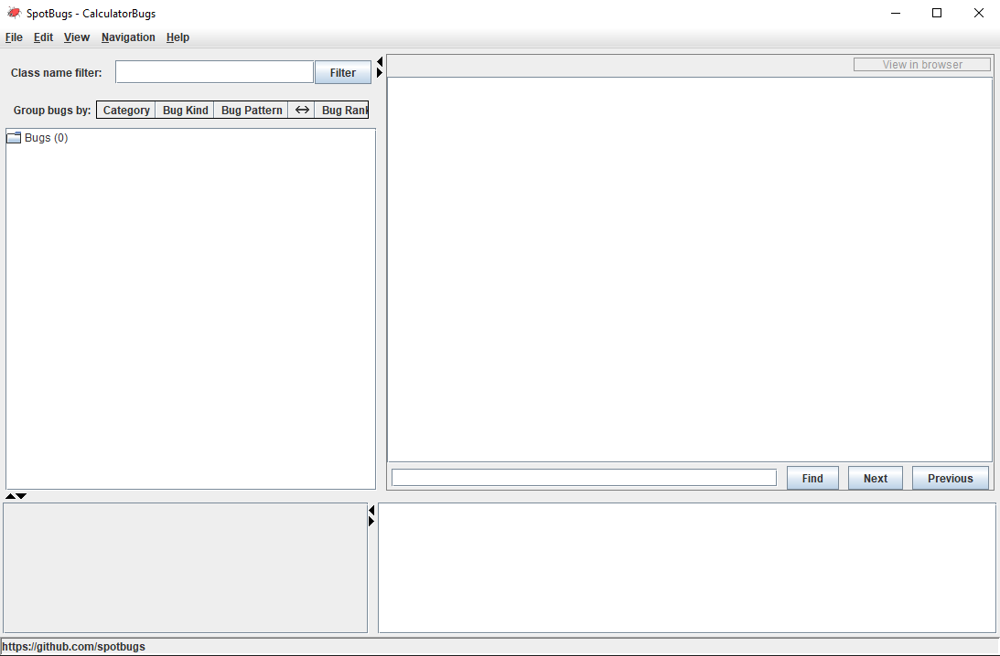
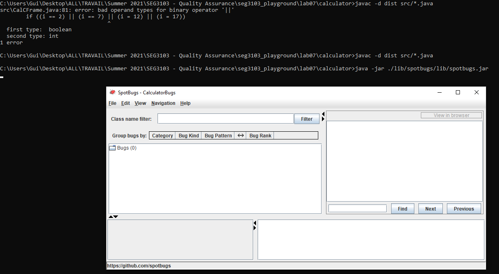

# Lab 7

| Outline | Value |
| --- | --- |
| Course | SEG 3103 |
| Date | Summer 2021 |
| Professor | Andrew Forward, aforward@uottawa.ca |
| Team | Guillaume Labasse 300132984 |

### Table of Contents  
[System & Environment](#system--environment)  
Lab Proceedings:
* [1 — Running Things](#1--running-things)  
* [2 — Spotting Bugs](#2--spotting-bugs)  
* [3 — Fixing Bugs](#3--fixing-bugs)  
<br><br><br>

### System & Environment

**OS**: Windows 10<br>
**Java**: 1.8.0_261 (Java 8)<br>
**JUnit**: 5 (via Standalone)

<br><br><br>

### 1 — Running Things

<details>
<summary>Click to expand!</summary>

<br>Let's first compile and run the application:

```bash
$ javac -d dist src/*.java
$ java -cp ./dist Main
```



The application runs correctly and appears mostly bug-free from playing around with it for a few minutes.
<br>I had to lower the width of the window for it to render the buttons correctly.
<br>Even though it wasn't asked for, let's also run the provided tests:

```bash
$ javac -d dist -cp lib/junit-platform-console-standalone-1.7.1.jar src/*.java test/*.java
$ java -jar lib/junit-platform-console-standalone-1.7.1.jar --class-path dist --scan-class-path
```



All tests ran successfully.<br>
An [initial commit](https://github.com/Guy-L/seg3103_playground/commit/f307a19d274cdf63ad277619fcbe51cf5e5e1afe#diff-173996138866d41583e457187fb735b238d2eed897ac330f49b17c60e40b754c) has been made before any code changes, as requested.
</details>

<br><br><br>

### 2 — Spotting Bugs

<details>
<summary>Click to expand!</summary>

<br>It's now time to run the diagnostics tool.<br>Just to make sure, I'll include a couple screenshots of SpotBugs running for the first time, in addition to showing its results.<br>Let's run the SpotBugs application:

```bash
$ java -jar ./lib/spotbugs/lib/spotbugs.jar
```



Here is the information I've entered to setup the SpotBugs project:


Here is SpotBugs, mid-analysis:


And finally, here are our results:


Just like in the Lab Recording, we find **18 bugs**: **2** in "Bad Practice", **10** in "Performance" and **6** in "Dodgy Code".<br>These being:

* **Bad Practices**
 1. A string comparison that doesn't use `equals()` (address comparison rather than content).
 2. Threading issues risk created from calling a method in the wrong thread.
* **Performance**
 1. An inner class does not need to store reference to outer class, can be changed to a named static inner class.
 2. A testing method is never used and can be removed.
 3. Useless creation of a boxed primitive (i.e., "`Integer`" or "`Double`" objects) to read value from string.
 4. Same as above.
 5. Instance final variable is initialized at compile-time; can be static to save space. 
 6. Same as above.
 7. Same as above.
 8. Same as above.
 9. Same as above.
 10. Same as above.
* **Dodgy Code**
 1. Two branches in a conditinal share the same code and can be unified.
 2. A switch statement is missing its `default` case.
 3. An evaluation in a conditional is redundant based off prior evaluations.
 4. Same as above.
 5. Same as above.
 6. Same as above.
  
</details>

<br><br><br>

### 3 — Fixing Bugs

<details>
<summary>Click to expand!</summary>

<br>See [`Main.java`](https://github.com/Guy-L/seg3103_playground/blob/master/lab07/calculator/src/Main.java), [`CalCFrame.java`](https://github.com/Guy-L/seg3103_playground/blob/master/lab07/calculator/src/CalCFrame.java) and [`CalCFrameTest.java`](https://github.com/Guy-L/seg3103_playground/blob/master/lab07/calculator/test/CalCFrameTest.java).
<br>I will highlight the code changes relevant to each previously-identified bug in this table:

<table>
  <tr>
    <td>
      Bug #
    </td>
    <td>
      Before
    </td>
    <td>
      After
    </td>
  </tr>
  
  <tr>
    <td>
      BP-1
    </td>
    <td>
    <pre lang="java">
if ( s == "" )</pre>
    </td>
    <td>
    <pre lang="java">
if (s.isEmpty())</pre>
    </td>
  </tr>
  
  <tr>
    <td>
      BP-2
    </td>
    <td>
    <pre lang="java">
setVisible(true); //in Main.java</pre>
    </td>
    <td>
    <pre lang="java">
public CalCFrame(String title) {

  super(title);
  setVisible(true); //in CalCFrame.java
  //...</pre>
  </td>
  </tr>
  
  <tr>
    <td>
      P-1
    </td>
    <td>
    <pre lang="java">
addWindowListener(new WindowAdapter() {
  public void windowClosing(WindowEvent e) {
  System.exit(0);
}});</pre>
    </td>
    <td>
    <pre lang="java">
private static class CustomWindowAdapter extends WindowAdapter {
  public void windowClosing(WindowEvent e) {
    System.exit(0);
  }
}
//...
addWindowListener(new CustomWindowAdapter());</pre>
    </td>
  </tr>
  
  <tr>
    <td>
      P-2
    </td>
    <td>
    <pre lang="java">
private void setClearscreen(CalCFrame cframe, 
                            boolean val) {
//...
}</pre>
    </td>
    <td>
      (removed)
    </td>
  </tr>
  
  <tr>
    <td>
      P-3
    </td>
    <td>
    <pre lang="java">
num1 = Double.valueOf( input ).doubleValue();</pre>
    </td>
    <td>
    <pre lang="java">
num1 = Double.parseDouble(input);</pre>
    </td>
  </tr>
  
  <tr>
    <td>
      P-4
    </td>
    <td>
    <pre lang="java">
answer = Double.valueOf(s).doubleValue();</pre>
    </td>
    <td>
    <pre lang="java">
answer = Double.parseDouble(s);</pre>
    </td>
  </tr>
  
  <tr>
    <td>
      P-4.3
    </td>
    <td>
    <pre lang="java">
num2 = Double.valueOf( input ).doubleValue();</pre>
    </td>
    <td>
    <pre lang="java">
num2 = Double.parseDouble(input);</pre>
    </td>
  </tr>
  
  <tr>
    <td>
      P-4.7
    </td>
    <td>
    <pre lang="java">
num3 = Double.valueOf( input ).doubleValue();</pre>
    </td>
    <td>
    <pre lang="java">
num3 = Double.parseDouble(input);</pre>
    </td>
  </tr>
  
  <tr>
    <td>
      P-5 to P-10
    </td>
    <td>
    <pre lang="java">
private final int ADD=1,       
  SUB = 2,     
  MULT = 3, 
  DIVI = 4, 
  POW = 5, 
  SQRT = 6;</pre>
    </td>
    <td>
    <pre lang="java">
private static final int ADD=1,       
  SUB = 2,     
  MULT = 3, 
  DIVI = 4, 
  POW = 5, 
  SQRT = 6;</pre>
    </td>
  </tr>
  
  <tr>
    <td>
      DC-1, DC-3 to DC-5
    </td>
    <td>
    <pre lang="java">
if ( i <= 2 )
  getContentPane().add( buttons[i] );
else if ( i >= 3 && i <= 7)
  getContentPane().add( buttons[i] );
else if ( i >=8 && i <= 12 )
  getContentPane().add( buttons[i] );
else if ( i >= 13 && i <= 17 )
   getContentPane().add( buttons[i] );
else
  getContentPane().add( buttons[i] );</pre>
    </td>
    <td>
    <pre lang="java">
getContentPane().add( buttons[i] );</pre>
    </td>
  </tr>
 
  <tr>
    <td>
      DC-2
    </td>
    <td>
    <pre lang="java">
switch( oper ) {
  // ...
  // no default case
}</pre>
    </td>
    <td>
    <pre lang="java">
switch( oper ) {
  // ...
  default: 
    clearScreen();
    System.out.println("Calculate called without operator -> investigate!");
    break;
}</pre>
    </td>
	
  <tr>
    <td>
      DC-6
    </td>
    <td>
    <pre lang="java">
else if (morenums) { </pre>
    </td>
    <td>
    <pre lang="java">
else {</pre>
    </td>
</table>

**Note**: Two additional performance bugs only showed up after fixing bugs P-3 and P-4; I've added them to the table under the name "P-4.3" and "P-4.7". They were the same type of error as P-3 and P-4.

Let's now run SpotBugs again:


All bugs have been eliminated.<br>
After searching for bugs manually, I found this section of code which, for reasons I do not fully understand, did not cause SpotBugs to display a "two branches in conditional share code" issue:

```java
if ( i == 2 )
  getContentPane().add( new JLabel( "  " ) );
else if ( i == 7 )
  getContentPane().add( new JLabel( "  " ) );
else if ( i == 12 )
  getContentPane().add( new JLabel( "  " ) );
else if ( i == 17 )
  getContentPane().add( new JLabel( "  " ) );
```

Which I refactored to:

```java
if (i == 2 || i == 7 || i == 12 || i == 17)   
  getContentPane().add(new JLabel("  "));
```

I made sure to run SpotBugs once more after making this change:


The project remained at 0 bugs.
<br>Have a great day!
</details>

